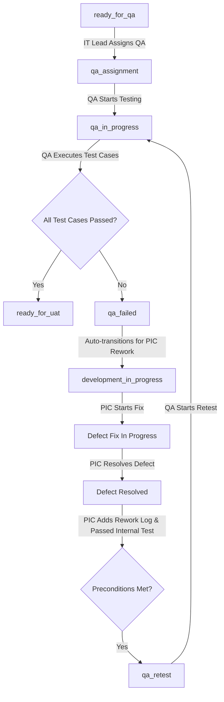

# Phase 9 — QA Assignment, Execution, Defect Rework, and Retesting

This document details the architectural design, workflows, endpoints, and validation gates implemented for **Phase 9**.

---

## 1. Workflows & State Machine

The complete state transitions for the QA process are:

### QA Cycle & Run Numbering
1. **Initial Testing:** `cycle_number` begins at `1` and `run_number` begins at `1`.
2. **Retesting:** Every time the PIC submits a ticket for retesting and the QA starts the retest, `cycle_number` increments by `1`.
3. **Execution Runs:** Within a cycle, the `run_number` increments every time a new test run is initialized by the QA.

---

## 2. Validation & Security Gates

### Constraint 4: Failed Result Defect Requirement
- A test run **cannot be completed** unless every test case marked as `failed` has a recorded defect linked to it.
- A test case marked as `blocked` must have either a linked defect or a documented blocking reason.

### Retest Preconditions (PIC Gate)
Before a PIC can submit a ticket for QA retesting (`submit-qa-retest`), the system enforces:
1. **Progress:** The ticket progress must be `100%`.
2. **Rework Worklogs:** At least one worklog of type `rework` must be recorded *since the last QA failure timestamp*.
3. **Internal Test Run:** At least one passed internal test run must be completed *since the last QA failure timestamp*.

### Database Concurrency (Row Locking)
All state transitions employ pessimistic row locking (`lockForUpdate()`) to prevent race conditions during simultaneous API requests or duplicate assignment requests.
Duplicate active assignments for the same ticket return an **HTTP 409 Conflict**.

### Nested Resource Binding
Endpoints validating nested child resources (e.g. `/api/v1/qa/tickets/{ticket}/test-runs/{run}`) verify that the child resource (`{run}`) belongs to the correct parent ticket (`{ticket}`). Requests mismatching ticket ownership yield an **HTTP 404/403** error.

---

## 3. Technical Detail Redaction

To prevent sensitive technical details from leaking to unauthorized roles:
- Comments and attachments linked to a `defect_id` are automatically filtered out (redacted) in `TicketResource` when accessed by users with `requester` or `executive` roles.
- Custom status badges translate QA statuses into user-friendly Indonesian descriptions.

---

## 4. REST API Contracts

### IT Lead Endpoints
- **GET** `/api/v1/it-lead/qa-assignment-queue` (List tickets waiting for QA assignment)
- **GET** `/api/v1/it-lead/qa-workloads` (Get QA workload analysis)
- **POST** `/api/v1/it-lead/tickets/{ticket}/assign-qa` (Assign QA to ticket)

### QA Endpoints
- **GET** `/api/v1/qa/assignments` (List assigned tickets)
- **POST** `/api/v1/qa/tickets/{ticket}/start` (Start testing/retesting)
- **POST** `/api/v1/qa/tickets/{ticket}/test-cases` (Define test cases)
- **POST** `/api/v1/qa/tickets/{ticket}/test-runs` (Start test run)
- **POST** `/api/v1/qa/tickets/{ticket}/test-runs/{run}/results` (Record case result)
- **POST** `/api/v1/qa/tickets/{ticket}/test-runs/{run}/complete` (Complete run)
- **POST** `/api/v1/qa/tickets/{ticket}/defects` (Report defect)
- **POST** `/api/v1/qa/tickets/{ticket}/defects/{defect}/verify` (Verify defect fix)
- **POST** `/api/v1/qa/tickets/{ticket}/defects/{defect}/reopen` (Reopen defect)
- **POST** `/api/v1/qa/tickets/{ticket}/evidence` (Upload QA evidence)

### PIC Rework Endpoints
- **POST** `/api/v1/pic/tickets/{ticket}/qa-defects/{defect}/start` (Start fixing defect)
- **POST** `/api/v1/pic/tickets/{ticket}/qa-defects/{defect}/resolve` (Resolve defect with notes)
- **POST** `/api/v1/pic/tickets/{ticket}/submit-qa-retest` (Submit rework for retesting)
- **POST** `/api/v1/pic/tickets/{ticket}/development-evidence` (Upload PIC evidence)

---

## 5. Automated Verification Status
- Integration test suite: `tests/Feature/QaDefectRetestTest.php`
- Assertions verified: E2E QA workflows, duplicate assignment prevention, nested boundary validations, evidence upload permissions, and role-based data redaction.
- Test coverage status: **Passed with 72 tests and 745 assertions**.
